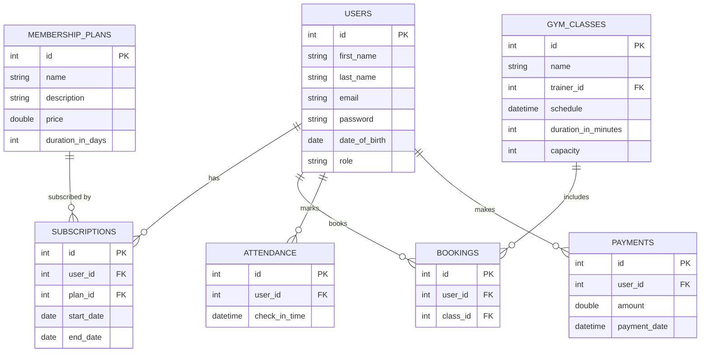

# 🏋️ Gym Management System - Spring Boot Backend  

A comprehensive and robust backend for a **Gym Management System** built with **Spring Boot**.  
This application provides a complete **RESTful API** for managing members, subscriptions, class bookings, and authentication, with **role-based access control** for different user types.  

---

## ✨ Features  

- **User Authentication**  
  - Secure registration and login using **JWT (JSON Web Tokens)**.  
  - Passwords encrypted with **BCrypt**.  

- **Role-Based Authorization**  
  - Supports roles: **MEMBER, STAFF, ADMIN**.  
  - Admins can register Staff and other Admins.  
  - Protected endpoints ensure users only access authorized resources.  

- **Membership Management**  
  - Admins can create and manage membership plans (Monthly, Quarterly, Annual, etc.).  

- **Subscription Handling**  
  - Members can subscribe to plans.  
  - Automatic calculation of subscription **start and end dates**.  

- **Class Booking System**  
  - Members with active subscriptions can book classes.  
  - Capacity validation before confirming bookings.  

- **Attendance Tracking**  
  - Members can check-in to mark attendance.  

- **Payment Processing**  
  - Dummy endpoint simulates subscription payments.  

---

## 🛠️ Tech Stack  

- **Java 17**  
- **Spring Boot 3** – REST API framework  
- **Spring Security** – Authentication & Authorization  
- **Spring Data JPA (Hibernate)** – ORM and database access  
- **MySQL** – Relational database  
- **Lombok** – Reduce boilerplate code  
- **jjwt** – JWT handling  

---

## ⚙️ System Architecture  

The backend follows a **layered architecture** for maintainability:  

- **Controller Layer** – Exposes REST API endpoints and handles requests.  
- **Service Layer** – Business logic (e.g., active subscription check).  
- **Repository Layer** – Database access using Spring Data JPA.  
- **Security Layer** – Validates JWTs and enforces role-based access.  

---

## 🚀 Setup and Run  

### ✅ Prerequisites  
- Java JDK 17 or later  
- Maven 3.8+  
- MySQL Server  
- REST client (Postman / cURL)  

### ⚡ Backend Setup  

```bash
# Clone the repository
git clone <your-repo-url>
cd GymManagementBackend

# Configure MySQL in application.properties
spring.datasource.url=jdbc:mysql://localhost:3306/gymdb
spring.datasource.username=root
spring.datasource.password=yourpassword

# Configure JWT secret key
application.security.jwt.secret-key=your-secret-key

# Run the application
mvn spring-boot:run
```

The backend will start at: **http://localhost:8080**  

---

## 🧪 API Endpoints & Sample Queries  

> 🔑 Note: For protected endpoints, login first to get a JWT token. Replace `{{adminToken}}` and `{{memberToken}}` with real tokens.  

### 1. Authentication  

(Register, Login, Admin registration examples...)  

### 2. Memberships  

(Create and subscribe examples...)  

### 3. Gym Classes  

(Create and book examples...)  

### 4. Attendance & Payments  

(Mark attendance and payments examples...)  

---

## 📄 Database Schema  

Core tables:  

- `users`  
- `membership_plans`  
- `subscriptions`  
- `gym_classes`  
- `bookings`  
- `attendance`  
- `payments`  

### 🗂️ ER Diagram  



---

## 📌 Future Enhancements  

- Integration with real **payment gateways** (Stripe/PayPal).  
- Email & SMS notifications for bookings and renewals.  
- Reports & Analytics dashboard for admins.  
- Mobile app integration.  

---

## 👨‍💻 Author  

Developed with ❤️ using **Spring Boot & MySQL**.  
